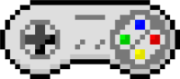

# rusticade

A fully featured terminal-based arcade built in Rust. Play games like

- Space Invaders
- Breakout
- Pong  
etc.

The full list of games can be found in the `GAMES.md` file and the `src/games` folder. I would love for you to develop and add your own ports of Atari 2600 games.

This project is still in its early stages, so expect bugs and missing features.

## How to install

You will need Rust and Cargo for this game. You can install it by running

```bash
cargo build --release
cargo install --path .
```

## How to play

For more information on this, refer to the HOWTO file.


## Documentation

The documentation on the crate and the development process can be found [here](). Refer to the `docs` folder for more information.

## What is the motivation behind this project ?

These were developed in an effort to not have to scour the Internet for some fun games to play in the terminal. All the games that you desire is here in one arcade - Rusticade. There is still a way to go with developing and polishing the UI for some of the games.
